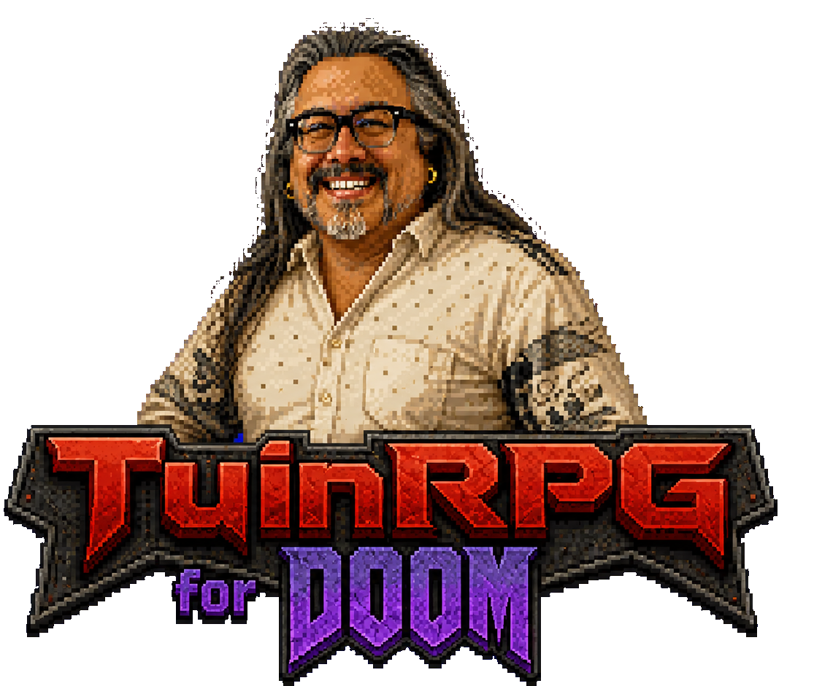

# TuinRPG for Doom

<p align="center">
  
</p>

TuinRPG is an RPG conversion for **GZDoom and UZDoom**. It adds player levels, classes, perks, rare monsters, affixes, weapon loot, finale bosses, a minimap and an end-level merchant. The release now includes the ProjectSIDE weapon/effects compatibility edition, providing its complete animated weapon set and quick grenades without a separate companion PK3. Monsters, maps and the player class remain untouched.

The ready-to-play `TuinRPG.pk3` is included in this repository and on the [GitHub Releases page](https://github.com/tuin-boop/TuinRPG/releases). For a compact introduction, see the [Quick Guide](QUICK_GUIDE.md).

## Quick start

1. Install a recent GZDoom or UZDoom build. Development is tested with **UZDoom 4.14.3**.
2. Download `TuinRPG.pk3` from the latest release.
3. Load it after your maps and visual/content mods. Do not also load `ProjectSIDE_WeaponsEffects_Compat.pk3`; it is already included:

   ```powershell
   uzdoom.exe -file mymap.wad myvisualmod.pk3 TuinRPG.pk3
   ```

4. Start a game and press `K` for the character screen. TuinRPG settings are also available directly from the Escape menu.

## Contents

- [Controls](#controls)
- [Classes and perks](#classes-and-perks)
- [Core features](#core-features)
- [Difficulty and monster progression](#level-modes)
- [Rarity and affixes](#rarity-and-affixes)
- [Weapon variants](#weapon-variants)
- [Minimap, finale bosses and John](#minimap-finale-bosses-and-john)
- [Compatibility](#compatibility-notes)
- [Building from source](#building-from-source)

## Controls

| Key | Action |
| --- | --- |
| `K` | Character screen, attributes, classes and perks |
| `L` | Arsenal and equipped weapon variants |
| `Q` | Open/close the mouse-controlled weapon wheel |
| `N` | Toggle the minimap |
| `F` | Toggle the flashlight |
| `G` | Throw a quick grenade |
| `V` | Activate the selected class ability |
| `E` / Use | Equip nearby loot or interact with John |

All bindings can be changed under **Customize Controls > Tuin RPG**.

## Classes and perks

Every five levels awards one perk point. The first point permanently selects a class:

| Class | Core role |
| --- | --- |
| **Tank** | 300 base health, 50% less damage taken and dealt, +100% ammunition gained, a 20%-max-health direct-hit cap, and damage-powered Overdrive |
| **Healer** | Heals the team for 5 HP every two seconds, deals 25% less damage, gains 25% more ammunition, and throws Field Supplies |
| **Executioner** | Deals 30% more damage, has 25% less maximum health, and spends damage-powered Judgment to sentence priority targets |
| **Doom Guy** | Deals 10% more damage, takes 10% less damage, regenerates health, and charges a healing cone-shaped Blood Punch |
| **Rogue** | Has 20% less maximum health, +5% critical chance, causes critical hits to bleed enemies, and can actively trigger Shadow Veil for a powerful ambush |
| **Engineer** | Has 15% less maximum health and 10% less weapon damage, but manages a persistent, recoverable 400-HP auto-turret with 250 physical tracer rounds |

Later points buy three ranks of **Vital Core**, **Scavenger**, **Killer Instinct**, **Iron Skin**, **Blood Drinker** and class-specific training. A permanent **Class Ultimate** becomes available at level 20 after Class Training II. Executioner Class Training builds Judgment 10% faster per rank. Doom Guy Class Training builds Blood Punch 10% faster per rank; its Ultimate increases that to 45% and strengthens its healing. Rogue Class Training adds +2% critical chance, two seconds of Shadow Veil duration, and 15% more Shadow Charge from damage per rank. The Rogue's ambush deals x4 weapon damage or x20 fist/knuckle damage. Engineer Class Training adds 10% sentry damage and 10% more Fabrication per rank. Its **Twin Sentries** Ultimate unlocks a second independently maintained turret slot.

## Core features

- Generic hostile-monster detection (`ISMONSTER`, shootable, alive, not friendly)
- Integrated ProjectSIDE animated fist, chainsaw, pistol, rifle, shotgun, super shotgun, chaingun, rocket launcher, plasma rifle and BFG replacements with their firing effects, sounds, casings and projectiles
- Integrated quick grenades on `G`: two starting grenades, five maximum (eight with a backpack), physical pickups/drops, a first-person pin-and-throw animation and a multi-band blast
- Progressive or fully random monster levels with configurable bounds/variance
- Hybrid progressive scaling that keeps map progression primary while letting monsters partially catch up when the player is far ahead; higher rarities and occasional surge rolls create threatening outliers
- An optional Hell Director that evaluates damage taken at 25%, 50% and 75% kills and can awaken an Elite, Legendary or Mythic threat. From player level 15 onward, ordinary awakenings scan the complete living roster and first exhaustively prefer Cacodemon-strength monsters or heavier (400+ original health), falling back to lighter monsters only when no eligible heavy candidate exists. Dormant and unseen monsters still count as available. Rare successful checks can still send a specially announced translucent Assassin Imp to an older player trail position. At the same checkpoints, critically low reserves can silently upgrade one untouched, out-of-sight Clip, Shell, Rocket or Cell pickup into its large-box equivalent. The reserve threshold scales from 40% on enemy-heavy maps down to 15% with fewer than ten monsters remaining, and shuts off below four survivors.
- Configurable monster health and outgoing-damage scaling
- Crosshair-targeted monster name, level, health bar, and exact HP
- Optional world-space monster bars with live HP, rarity colors, level/name and compact affix labels
- A custom end-level **Mission Report** with animated completion bars, mission/par time, a pace bonus, a weighted 0-1000 score, E-through-S rating, RPG combat/progression statistics, and a rating-aware verdict from John. Kills are worth 300 points, items 150, secrets 150, pace 100, and preserving lives 300. Full kills and perfect pace with no deaths reach C when items and secrets are ignored.
- At every 10% kill milestone, John has a 50% chance to appear near the lower right with one of 50 tactical tips, class reminders, or comments about the run. His floating revival portrait is reused with a compact dialogue panel and one of three randomized notification sounds, and **John's combat tips** can be disabled in the HUD options.
- A limited-lives system starts each player with three lives. Lethal damage spends one life and begins a protected 4.2-second revival scene with a red pulse, particles, a drifting John portrait, and one of his encouragement lines. The same player then returns to the map start at full health with three seconds of protection, preserving inventory and map progress. Rare and stronger enemies can drop a compact floating extra-life heart, with higher tiers receiving better chances. The default maximum is nine lives.
- Every counted monster has a configurable 10% chance to drop a handmade floating and spinning **Life Essence** voxel. Each pickup immediately grants 30 stackable temporary current and maximum health. Untouched temporary health fades at one point per second; incoming damage consumes that pool first and is not removed a second time by the timer. Its five randomized sounds use a dedicated channel so simultaneous item pickups cannot silence them. There is deliberately no collection counter or 50-essence reward.
- Lost Souls always carry **Fodder** and take 50% more player damage. Any monster packed into a local crowd of at least eleven living hostiles within 512 map units receives the same visible debuff, easing ammunition pressure in slaughter encounters.
- Player XP, nonlinear levels, XP popups, and one stat point per level
- Optional Doom late-start/warp catch-up with matching levels/points and three Rare-or-better, weapon-mod-aware starting drops
- Vitality (+5 max HP), Strength (+2% outgoing damage), Luck (+0.5% critical chance plus a diminishing bonus-XP proc), Agility (+2% firing speed), and Endurance (-1% damage taken, capped at 75%); combined firing speed is capped at +75% and total critical chance at 50%
- A permanent first-perk class choice: Tank (300 base HP, 50% protection, -50% damage, +100% ammo, and Overdrive), Healer (team-wide 5 HP healing every two seconds, -25% damage, +25% ammo, and a V-key Field Supply toss), Executioner (+30% damage, -25% maximum health, Judgment and Death Sentence), Doom Guy (+10% damage, 10% protection, regeneration, and Blood Punch), Rogue (20% lower maximum health and an actively triggered Shadow Veil), or Engineer (a deployable physical-tracer auto-turret). The choice costs one perk point.
- Rogues have +5% innate critical chance. Their critical hits, including forced Ambush criticals, inflict eight seconds of bleeding that repeats the triggering critical hit's total damage over eight ticks, capped at 24% of the target's RPG-scaled maximum health. Bleeding cannot refresh or stack, and the monster resists new Bleeding for 12 seconds after it ends. Critical hits still deal normal critical damage during both states. Bleeding appears on the target display and overhead health bar, with red floating damage numbers. Rogue Class Training adds another +2% critical chance per rank.
- Press the configurable **Class Ability** key (`V` by default) for the Tank's Overdrive, Healer's Field Supply, Executioner's Death Sentence, Doom Guy's Blood Punch, Rogue's Shadow Veil, or Engineer's auto-turret. Field Supply throws one Health Bonus, Stimpack, or Medikit forward every 20 seconds, with a 2% Soulsphere chance and a visible cooldown timer. Tank Overdrive charges from damage dealt plus four times health actually lost; its threshold is `800 + 50 × player level`. At full charge, `V` grants +150% weapon damage and firing speed for ten seconds with a red glow. It cannot recharge while active and empties when it ends. Normal combined firing-speed bonuses remain capped at +75%, while Overdrive safely raises that combined cap to +200%.

- Engineer places its sentry 64 units ahead. It automatically acquires visible hostile monsters within 1,280 units and fires physical 3D tracer rounds until destroyed or its 250-round magazine is empty. Press `V` within 112 units of a healthy sentry to pack it; its exact health and ammunition are preserved for its next deployment. A destroyed or empty slot must be rebuilt through **Fabrication**, earned from kills and ammo pickups. Stronger kills give more progress, while bullets, shells, rockets, cells, and custom ammo are weighted by their practical value. Twin Sentries allows two simultaneous turrets, but each slot has its own state and rebuild requirement.

- Turret damage scales from 8 at level 1 by +1 every five player levels, then receives Engineer Class Training. On every deployment it snapshots 50% of the currently held weapon variant's item-level Power, Power affix, Haste, and critical bonus. This snapshot remains fixed while deployed, so later weapon switching cannot alter a turret remotely. Leech, Execution, Prosperity, elemental effects, and unique weapon behavior remain personal to the held weapon. Turret damage and kills still count toward the Engineer's RPG record and rewards. Use `netevent tuin_test_engineer_turret` to select Engineer and deploy one instantly for testing.
- Executioner weapon damage fills Judgment, requiring `500 + 50 × player level` damage before Class Training bonuses. At full charge, press `V` once to arm Judgment; the next ordinary weapon hit sentences the monster it strikes and up to two nearby visible hostiles within 384 units. Missing or hitting scenery does not spend the charge, and secondary damage such as grenades, bleeding, rocket burn, plasma arcs and Final Verdict cannot trigger it. Death Sentence lasts ten seconds, and a custom blood-red skull bobs above every sentenced monster. Marked targets take 25% more damage, reduced to 10% against Boss-tier monsters. Killing any of them while marked triggers Final Verdict, which uses the quick grenade's explosion visuals and damages other visible hostiles within 160 units for 18% of the executed monster's scaled maximum health. Final Verdict damage is clamped from 40 to 400. The **No Appeals** Class Ultimate extends the sentence to twelve seconds, raises the bonuses to 35% and 15%, expands Final Verdict to 224 units at 25% health with a 60-600 clamp, and refunds 25% Judgment once per cast after the first successful execution.
- Doom Guy's ordinary damage fills Blood Punch, requiring `500 + 40 × player level` damage for a full charge before training bonuses. Class Training builds charge 10% faster per rank. Hold `V` to lower the equipped weapon normally and bring up the ProjectSIDE fists; they remain ready for as long as the key is held. Release `V` to play the complete normal-speed punch. Its normal impact sound, crimson pulse, 110-degree cone and damage occur together on the contact frame. The cone reaches 240 units, deals `140 + 14 × player level` base damage (maximum 650) to every visible hostile, and heals Doom Guy for 20% of actual damage dealt, capped at 75 HP per punch. The Class Ultimate raises charge speed to 45% and healing to 30% of damage, capped at 110 HP. The previous weapon then raises normally. Blood Punch cannot crit, inherit weapon-affix damage, or recharge itself.
- Overdrive firing speed uses the engine's universal weapon-state accelerator, so slow launchers and one-tic custom weapon animations receive the boost consistently. Thrown grenades are tracked through contact, fuse, death animation, and custom cleanup; reaching, exploding near, or disappearing within 192 units of a Cyberdemon or Spider Mastermind adds a controlled boss-impact component of 2% scaled health (minimum 128, maximum 500 raw damage).
- Rogue Shadow Veil makes the Rogue half translucent and untargetable for six seconds, forcing monsters to disengage and wander. Attacking, taking damage, expiry, or pressing the ability again ends it. Its ambush attack deals x4 weapon damage or x20 fist/knuckle damage; iconic finale bosses use reduced x2 ranged and x5 melee multipliers. Shadow Veil begins ready, but after use it can only be restored by dealing ordinary weapon damage. A full charge requires `400 + 60 × player level` damage, before Class Training bonuses. Ambush and Bleeding damage do not refill the ability, preventing immediate loops, but sustained damage to a boss can earn another Veil during that fight. Waiting provides no charge. Each Class Training rank adds two seconds of duration and 15% more charge from damage.
- Later perk points purchase three ranks of Vital Core (+10 HP/rank), Scavenger (+10% ammo/rank), Killer Instinct (+2% critical chance/rank), Iron Skin (-3% incoming damage/rank), Blood Drinker (1% damage leech/rank), and a class-specific specialty. Blood Drinker and weapon leech count every damaging hit, carrying fractional healing between low-damage bullets and pellets instead of losing it to rounding. A level-20 Class Ultimate requires Class Training II.
- Floating combat damage numbers rise and curl away from hit monsters; rapid pellet hits merge into a readable total, critical hits appear larger and gold, and bleed damage appears separately in red.
- Mouse-operable character menu with pause, 10% slow motion, or no-pause mode
- Progress stored on the individual player as an inventory token, including in normal saves and across map transitions
- A full `Tuin RPG Options` page added to GZDoom's Options menu
- Scalable HUD text and a substantially larger targeted-monster health bar
- Configurable Normal, Uncommon, Rare, Elite, Legendary, and Mythic monsters
- Generated names, tier-colored HUD presentation, rarity health/damage scaling, and rarity XP bonuses
- Warm gold Legendary glows and stronger pulsing violet Mythic glows, with enable/radius options
- Archetype-aware Legendary/Mythic signature attacks with visible warning flashes and configurable cooldowns
- Rare, leveled weapon variants for weapons already owned, with colored/glowing drops, comparison HUD, Use-key pickup, and a persistent Arsenal
- Modular Swift, Armored, Regenerating, Berserker, Explosive, Vampiric, Poisonous, Healer, and Warding affixes
- Optional rotating minimap with explored geometry, rarity-monster tracking, weapon-drop diamonds and level statistics
- A configurable once-per-map level Boss tier above Mythic, with a 5% Godly chance by default
- Iconic E1M8, E2M8 and E3M8 episode Bosses with a guaranteed Godly weapon reward
- Four overall difficulty profiles: Easy, Normal, Hard and Crazy. Hard preserves the original balance; Normal halves health gained from monster levels. Profiles also tune damage growth, special-monster frequency and power, Boss scaling, and maximum affixes (2/3/5/8). Changing difficulty automatically rebalances living monsters when gameplay resumes and prints the effective values.
- Direct **Tuin RPG Options** access from the first Escape menu as well as the full Options menu.
- Boss-sourced Godly named weapons with stronger rolls and a distinct icy-white glow

Individual weapon XP/levelling, a codex and achievements are not included in this release.

## Building from source

PowerShell creates the distributable `TuinRPG.pk3` directly from `src`:

```powershell
.\build.ps1
```

For balance testing, open the console and enter `netevent tuin_give_levels 10` to grant ten player levels. The command accepts 1-100 levels at a time and awards the same stat points and every-fifth-level perk points as ordinary leveling. Open the character screen with `K`, then choose **Class and Perks** to select a permanent class and spend later points.

To test Blood Punch instantly, enter `netevent tuin_test_blood_punch`. This testing command selects Doom Guy and fills Blood Punch; hold and release `V` to use it, then repeat the command whenever another full charge is needed. New installations bind **Class Ability** correctly, while version 0.6.32 safely translates the old one-shot `V` binding into press/release input without changing the player's configuration at runtime.

To test Death Sentence instantly, enter `netevent tuin_test_death_sentence`. This selects Executioner and fills Judgment; press `V` once, then shoot a monster to sentence it and up to two nearby visible enemies.

For predictable load order, put TuinRPG after maps and visual/content packs. The separate `ProjectSIDE_WeaponsEffects_Compat.pk3` must not be loaded with this version because its complete contents are already bundled. Other weapon/gameplay replacements may override or conflict with the integrated ProjectSIDE weapons and are no longer part of the primary supported configuration.

## Level modes

- **Progressive:** uses the map's numeric level number where available, falling back to maps visited, then applies the configured random variance.
- **Random:** every detected monster rolls independently between the configured minimum and maximum.

Changing scaling settings affects newly initialized monsters. Existing monsters retain the values saved with them so loading a save cannot scale them twice.

Visible monsters within the configured overhead-bar range receive a compact display above their actor: name and level, a live rarity-colored health bar, exact HP, and short affix labels such as `SWIFT`, `ARMOR`, `REGEN`, `RAGE`, `BOOM`, and `LEECH`. The HUD options control their range and scale, how many nearby monsters may display one simultaneously, and whether the presentation uses the classic targeted bar, overhead bars, both styles, or neither.

With **Late-start/warp catch-up** enabled, beginning a new Doom game on a later map or making a non-sequential map jump raises an under-levelled player above that map's progressive base tier (three bonus levels by default). It preserves existing stats, awards only the missing stat/skill points, and spawns three distinct Rare-or-better weapon choices nearby. Accepting a newly granted catch-up weapon also refills 25% of each carried ammo type. Normal sequential map progression does not trigger it, and weapon classes are resolved through active replacements for compatibility with conventional weapon mods.

Ammo now grows with the campaign's tougher enemies. By default, every progression level after the first adds 2% to carried-ammo capacity (up to 2x) and 1.5% to ammo-pickup quantities (up to 1.75x), using whichever is higher between the player's level and map progression. Backpacks stack with the capacity bonus, and the system discovers custom ammunition classes used by weapon mods automatically. All values can be adjusted or disabled under **Tuin RPG Options > Ammo progression**.

The Hell Director also watches for complete stock-ammo exhaustion. Once per map for each of bullets, shells, rockets, and cells, reaching zero while at least four monsters remain allows one emergency rescue independently of the normal 25%, 50%, and 75% kill checks. The rescue never adds ammo directly: it quietly upgrades one untouched, unseen matching pickup to its large-box version. Visible, collected, player-dropped, grenade, and unknown custom-ammo pickups remain untouched; if no eligible pickup is currently hidden, the Director keeps the allowance and tries again later.

## Rarity and affixes

The default chances follow a descending curve: 15% Uncommon, 7% Rare, 2.5% Elite, 1% Legendary, and 0.5% Mythic. Each chance and the maximum affix count can be changed from **Tuin RPG Options**. Higher tiers gain health, damage, XP, additional affixes, generated names, and distinct HUD colors. Mythics may naturally roll four or five affixes; ordinary late-game finale Bosses can reach higher configurable counts, while the iconic episode encounters retain their smaller hand-balanced limits.

Rare, Elite, Legendary and Mythic enemies whose base health is below a Hell Knight normally reserve one trait slot for Armored. Their remaining traits are random. From player level 15 onward, enemies with at least a Cacodemon's 400 base health cannot roll Armored at all, because their scaled health pools already provide enough durability. Normal and Uncommon fodder do not receive the low-health guarantee.

Chance values are literal percentages: `1.0` is 1%, while `100` guarantees that tier when higher-priority tier chances are zero. Manual changes normally affect newly spawned monsters, so use **Reroll living monsters now** to update the current map. **Testing preset: all Mythic** and **Reset rarity defaults** both reroll living monsters automatically.

- **Swift:** uses additional `A_FastChase` calls while chasing, reacts immediately, searches for players more frequently, and retains a chosen player target longer.
- **Armored:** reduces incoming damage.
- **Regenerating:** restores a percentage of maximum health each second.
- **Berserker:** deals increased damage below 40% health.
- **Explosive:** creates a visible grenade-style, level-scaled death explosion that damages nearby players and hostile monsters with distance falloff.
- **Vampiric:** heals when damaging a player.
- **Poisonous:** applies a level-scaled damage-over-time effect to players.
- **Healer:** restores `5 + monster level` health per second to visible nearby allies. It self-heals for only 25% of that amount, and taking damage disables its self-healing for two seconds.
- **Warding:** grants visible nearby allies temporary damage reduction, but never protects the Warding monster itself.

Rogue Bleeding halves all monster healing while it remains active, including Healer, Regenerating, and Vampiric recovery.

TuinRPG's added player damage uses diminishing overflow during half-second bursts against stronger enemies. Base weapon damage is never reduced. Rare-through-Mythic monsters receive the first 25% of maximum health in RPG bonus damage normally and only 25% of overflow; ordinary RPG bosses use a 15% threshold with 20% overflow, while iconic finale bosses use an 8% threshold with 15% overflow. Grouping damage into a short burst prevents BFG tracers, shotgun pellets, and rapid attacks from receiving a fresh threshold for every individual hit.

Cyberdemons and Spider Masterminds have 75% BFG resistance as an innate species trait. Direct BFG projectiles, tracer/splash damage, and recognizable replacement BFG weapons deal 25% damage to them. Other weapons remain fully effective, encouraging a broader arsenal without making any weapon mandatory.

Affix effect strengths have their own tuning submenu. Forced/scripted damage bypasses Armored and player Endurance so telefrags and mandatory map logic remain reliable.

## Signature attacks

Legendary monsters gain a gold-telegraphed signature attack; Mythic monsters use stronger patterns more often after a violet warning flash. Attacks follow the monster's combat identity: hitscanners fire appropriate bullets, Doom projectile monsters use their native projectile family, and melee monsters charge. Unknown custom ranged monsters repeat their own missile state, while unknown melee monsters receive only a physical charge. Bosses, Archviles, Pain Elementals, and Lost Souls are excluded to avoid disrupting scripted encounters and monster-summoning logic.

## Weapon variants

Every defeated monster has a small chance to drop a variant of a weapon already owned by the killing player. The default base chance is 1.5%; monster rarity and player Luck improve it. Normal enemies can still produce every quality through Mythic, but high-end results remain exceptionally rare. Finale Bosses guarantee a Godly weapon, while native/custom actors carrying the engine's `BOSS` flag receive a separate 5% direct Godly chance. Item level is based on the defeated monster's level (plus a small variance) and improves the rolled affix strengths.

Weapon variants can roll firing speed, damage, damage leech, execution damage, kill XP, or critical chance. Every item level after level 1 also grants +2% inherent damage, capped at +60%, so later drops can compete with exceptional early-game equipment. Critical hits deal double damage; grenade damage cannot critically hit. The player begins with 2% critical chance, Luck adds 0.5% per point, and a Keen Godly weapon can add up to 16% at item level 40. A maximum-level Godly roll can reach roughly +42% firing speed, +42% rolled damage, +60% item-level damage, +43% execution damage, +42% kill XP, or 14% leech depending on its four selected affixes. Equipping a Godly variant also creates an icy-white first-person pulse without replacing the underlying weapon actor.

Rockets add a four-second incendiary burn to every monster damaged by their explosion. The direct impact target burns for 32% of its final hit damage, while surrounding victims burn for 16% of the explosion damage they individually received. Plasma Rifle shots arc 20% of their final impact damage to other visible monsters within 192 map units. Armor and Warding still mitigate these secondary hits; they cannot critically hit or recursively produce more elemental damage. Floating burn numbers are orange and plasma-arc numbers are bright plasma blue.

Shotgun and Chaingun variant rolls can occasionally become special weapon frames. By default, a Shotgun roll has an 8% chance to become the **Riot Shotgun**: five pellets rather than seven, wider spread, one shell per shot, no magazine reload, a complete 28-tic pump-and-recovery sequence, and one shot per trigger pull. A Chaingun roll independently has an 8% chance to become the **Minigun**. It has an eight-tic spin-up, fires one three-damage round every two tics, drains ammunition at roughly twice the regular rate, winds down on release, and reloads its internal 100-round belt while still using ordinary bullets. When its shared bullet supply is empty it dry-fires, reports the shortage, and automatically switches to another usable weapon. Both retain normal item levels, qualities and affixes, use distinct artwork and sounds, and can subsequently receive upgraded variants of their own. Their conversion chances and direct test drops are under **Tuin RPG Options > Weapon Loot**.

Look near a drop to see its quality, item level, gear score, and a row-by-row comparison of every stat against the current variant—including bonuses that would be lost. Drops within 80 map units can be inspected from either visible side without aiming at the actor's hidden origin; inspection out to 256 units requires facing the drop, and the card briefly persists when aim moves away. Both distances are configurable. Move within 128 map units and press Use (`E` by default) to equip it. The Arsenal stores only one variant for each weapon class: accepting a replacement immediately places the previous variant on the floor. Press `L` to inspect the persistent Arsenal with Up/Down. The weapon-loot options include a complete reset that clears collected variants and floor drops and restores normal drop settings. The underlying weapon actor is never replaced: TuinRPG applies the active variant's bonuses as an RPG layer for compatibility with custom weapons.

Press `Q` once to open the paused weapon wheel. Move the mouse toward an owned weapon, then press `Q` again, left-click or Enter to equip it; Escape or right-click cancels. Each segment displays the actual active weapon-replacement name and its combined ammunition. Ammo bars transition continuously from red when nearly empty, through yellow, to green when well supplied. Ammo-free melee and infinite-ammo weapons are identified separately.

## Minimap, finale bosses and John

John's partial refill restores 25% of every carried ammo type for 100 coins. The separate 10-coin cache restores only a small amount of one random carried ammo type.

Ordinary promoted bosses reach at least player level +1. A boss originating below Hell Knight base health calculates its health from a 200-HP minimum and reserves one affix slot for full ordinary Armor, reducing damage by 50% by default. Hell Knights and stronger candidates do not receive forced Armor; if they randomly roll it, their Boss Armor defaults to 25% reduction.

Defeating an ordinary promoted level Boss plays one of two randomized victory cues. Iconic episode finales retain their separate John sequence.

The optional minimap draws explored level geometry, player direction, exits, locked doors and kill/item/secret totals. Once a special monster has been seen, its last-known position remains marked with a rarity-colored circle. Legendary, Mythic and Boss threats receive stronger pulsing indicators, while weapon drops appear immediately as quality-colored diamonds and remain marked until collected or expired. Reaching 85% kills permanently activates Hunt for that map and reveals every surviving hostile. Ordinary enemies use bright yellow pulsing markers while special enemies retain their rarity colors, and distant survivors clamp to the minimap edge.

On maps containing at least eight monsters, reaching 85% kills promotes one eligible survivor into a finale **BOSS**, a sixth tier above Mythic. The classic Doom episode finales use their intended encounters instead: both Barons on E1M8, the Cyberdemon on E2M8 and the Spider Mastermind on E3M8 begin as Boss-tier enemies, with no unrelated extra promotion on those maps. These already-tough native bosses use gentler health and damage multipliers than ordinary promoted monsters. E1M8 divides its encounter budget across two Barons and gives each two offensive/mobility affixes; E2M8 and E3M8 receive three. The iconic encounters do not roll Armored or Regenerating, avoiding excessive effective-health combinations. E2M8's Cyberdemon and E3M8's Spider Mastermind are replaced only on those maps by identical TuinRPG finale subclasses, preventing their stock death frame from ending the episode automatically.

Once an iconic encounter is defeated, John remains available for shopping and conversation. Both **So... what now?** and **What comes next?** contain four story parts. Select either question repeatedly to advance its conversation; every part uses multiple lines and restarts the classic RPG letter by letter reveal. E1M8, E2M8, E3M8 and Doom II's MAP06, MAP11 and MAP20 have dedicated conversations. John also offers general four part post battle conversations after other finale Bosses. Choose the gold **Reach out and hold John Romero's hand (Go to next level)** entry when ready. This moves from E1M8 to E2M1, E2M8 to E3M1 or E3M8 to E4M1 while preserving health, inventory, weapons and Tuin RPG progression. E4M8 remains the true ending. Doom II continues from MAP06, MAP11 and MAP20 to MAP07, MAP12 and MAP21 only after John's conversation, retaining the original story intermission. John transitions never grant late-start levels, talent points or three catch-up weapons on the destination map. Other scripted bosses, dormant actors and monster-summoners are excluded. A promoted monster is fully healed with Boss-tier health, damage, XP and affixes, announced to the player, and permanently marked on the minimap. Defeating it guarantees a named Godly variant of an owned weapon. Godly weapons have four stronger affixes, an icy-white pulsing glow and a persistent special name. Native/custom BOSS actors instead have a separate 5% Godly chance.

Monsters can also drop physical Tuin coins. Uncollected coins within 320 map units accelerate toward the nearest living player when there is clear line of sight, so nearby rewards are pulled in without passing through walls. After the finale Boss dies, John appears nearby; face him and press Use (`E`) to open his shop. Arrow keys browse and Enter purchases health, ammo, armor, a backpack, or a 150-coin random variant of one of your currently owned weapons. The gamble always produces Uncommon or better and has a 20% total chance for Rare or better; Godly weapons remain Boss-exclusive. John also offers randomized conversation and gameplay tips. Coin frequency and John's shop can be adjusted or disabled in **Finale Boss Options**. For testing, `netevent tuin_test_john_shop` spawns John and grants 500 coins.

The `K` character screen is intentionally limited to progression, the Arsenal and total combat statistics; balance/configuration controls remain in the normal **Options > Tuin RPG Options** menu.

## Compatibility notes

The mod works automatically with custom actors that correctly identify as hostile monsters using GZDoom's standard monster/shootable flags. Actors that intentionally omit `ISMONSTER`, script all damage outside `DamageMobj`, or clear player inventory during a forced transition may require a future compatibility definition. The integrated ProjectSIDE edition replaces Doom's weapon actors but not monsters, maps, or DoomPlayer. Original ProjectSIDE contributor attribution and the compatibility-edition notes are packaged under `third_party/ProjectSIDE/` and retained in the source tree. The Riot Shotgun and Minigun artwork and sounds are adapted from **Lippeth Generic Weapons / Weapons of Saturn**, supplied with permission to reuse resources; detailed upstream attribution is retained under `third_party/LippethGenericWeapons/`. Single-player remains the primary tested configuration; data ownership and stat-spending commands are already per-player for later co-op work.
